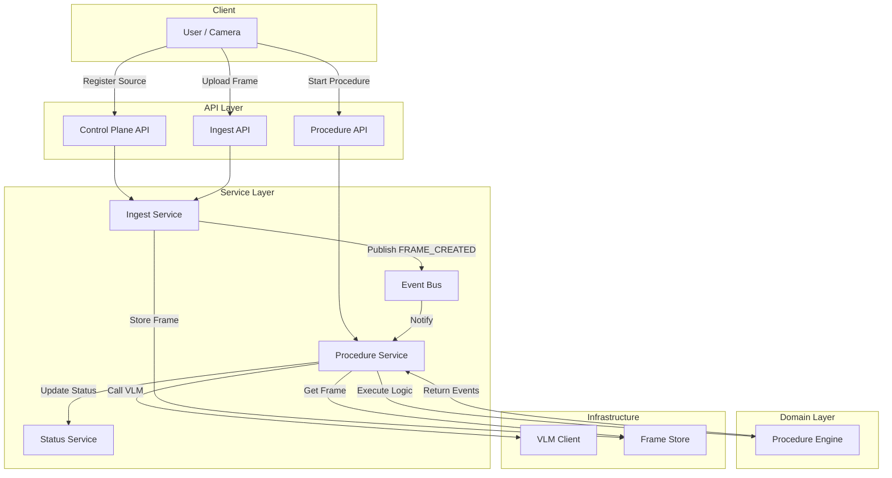
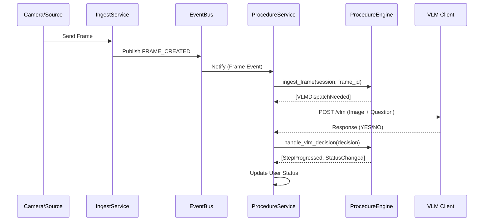

# Oneshot Copilot V2 Documentation

This document describes the V2 architecture of Oneshot Copilot, which introduces a modular, event-driven design to improve scalability, testability, and maintainability.

## 1. Architecture Overview

The V2 system moves away from a monolithic state machine to a **3-Layer Architecture**:

### 1.1. Layers

1.  **API Layer** (`app/api/v2`):
    *   Handles HTTP requests and responses.
    *   Delegates work to the Service Layer.
    *   **Key Files**: `control_plane.py`, `procedure_v2.py`.

2.  **Service Layer** (`app/services`):
    *   Orchestrates business logic and side effects (I/O, Database, VLM calls).
    *   Manages application state (active sessions, sources).
    *   Subscribes to and publishes events.
    *   **Key Components**: `ProcedureService`, `IngestService`, `StatusService`.

3.  **Domain Layer** (`app/domain`):e
    *   **Pure Business Logic**. No I/O, no API calls, no side effects.
    *   Receives state + input -> Returns events.
    *   **Key Component**: `ProcedureEngine`.

### 1.2. Event-Driven Communication

Services communicate via an **Event Bus**.
*   **Flow**: `IngestService` receives a frame -> Publishes `FRAME_CREATED` -> `ProcedureService` listens -> Calls `ProcedureEngine` -> Dispatches VLM request if needed.

## 2. Key Components

### Procedure Engine (`app/domain/procedure_engine.py`)
The "brain" of the operation. It is a pure class that:
*   Takes a `UserSession` and an input (e.g., `ingest_frame`, `handle_vlm_decision`).
*   Returns a list of `DomainEvents` (e.g., `StepProgressed`, `VLMDispatchNeeded`).
*   Handles step timeouts, debounce logic, and rule validation.

### Procedure Service (`app/services/procedure_service.py`)
The "manager". It:
*   Maintains active user sessions.
*   Loads procedure definitions from JSON files.
*   Handles the **Concurrency Policy** (see below).
*   Listens for `FRAME_CREATED` events.
*   Executes VLM calls (side effects) when the Engine requests them.

### Ingest Service (`app/services/ingest_service.py`)
Responsible for getting visual data into the system.
*   Registers **Sources** (cameras, RTSP streams).
*   Ingests frames and publishes them to the Event Bus.
*   Decouples the source of the image (HTTP upload, RTSP stream, etc.) from the processing logic.

### Control Plane (`app/api/control_plane.py`)
New API endpoints for system management:
*   Registering Sources.
*   Registering Jobs (background tasks).
*   System health and debug status.

## 3. Concurrency Policies

V2 introduces explicit policies for handling multiple procedure requests for the same user:

*   **`replace`** (Default): Aborts any existing procedure and starts the new one immediately.
*   **`queue`**: If a procedure is running, adds the new request to a queue. It will start automatically when the current one finishes.
*   **`parallel`**: Allows multiple procedures to run simultaneously for the same user (useful for complex, multi-task scenarios).

## 4. API Reference (V2)

All V2 endpoints are prefixed with `/api/v2`.

### Start Procedure
`POST /api/v2/procedures/start`
```json
{
  "username": "john_doe",
  "procedure_id": "pizza_custom@v1",
  "source_id": "camera_01",
  "policy": "replace"
}
```

### Start Procedure (Memory Strategy Example)
`POST /api/v2/procedures/start`
```json
{
  "username": "mikam",
  "procedure_id": "pizza_custom@v1",
  "source_id": "stream_user",
  "policy": "replace"
}
```

### Stop Procedure
`POST /api/v2/procedures/stop`
```json
{
  "username": "john_doe",
  "procedure_id": "pizza_custom@v1"
}
```

### Register Source
`POST /api/v2/sources`
```json
{
  "id": "camera_01",
  "name": "Kitchen Camera",
  "type": "rtsp",
  "config": { "url": "rtsp://..." }
}
```

### Debug Status
`GET /api/v2/debug/status`
Returns the full internal state of sources, active procedures, and queues.

## 5. Differences from V1

| Feature | V1 (Legacy) | V2 (New Architecture) |
| :--- | :--- | :--- |
| **State Logic** | Monolithic `StateMachine` class | Pure `ProcedureEngine` (Domain) + `ProcedureService` (Orchestration) |
| **Data Flow** | Direct function calls | Event Bus (`FRAME_CREATED`, etc.) |
| **Frame Ingestion** | Implicit, tied to specific endpoints | Explicit `Source` registration via `IngestService` |
| **Concurrency** | Single active procedure only | Configurable: `replace`, `queue`, `parallel` |
| **VLM Integration** | Tightly coupled in state machine | Decoupled via `VLMDispatchNeeded` event |
| **Testing** | Hard to test (requires mocking I/O) | Easy to test `ProcedureEngine` (pure logic, no mocks needed) |

## 6. Getting Started with V2

1.  **Start the Server**:
    ```bash
    uvicorn app.main:app --reload
    ```
    *The system automatically initializes services and registers default plugins/streams on startup.*

2.  **Register a Source** (if not auto-discovered):
    ```bash
    curl -X POST http://localhost:8000/api/v2/sources -d '{"id":"cam1", "name":"Test Cam", "type":"virtual"}'
    ```

3.  **Start a Procedure**:
    ```bash
    curl -X POST http://localhost:8000/api/v2/procedures/start -d '{"username":"user1", "procedure_id":"pizza_custom", "source_id":"cam1"}'
    ```

4.  **Ingest Frames**:
    ```bash
    curl -X POST http://localhost:8000/api/v2/ingest/frame -F "file=@image.jpg" -F "source_id=cam1"
    ```

## 7. System Visualization

### 7.1. Component Architecture



### 7.2. Frame Processing Flow


