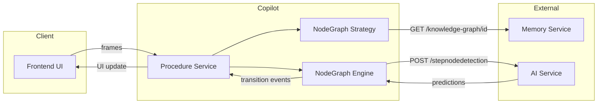
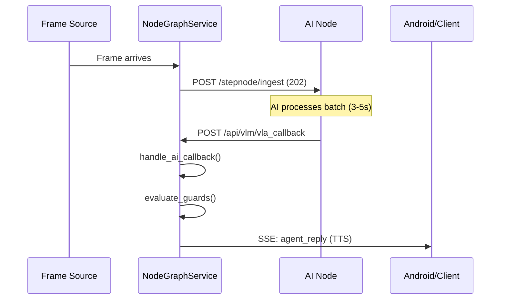
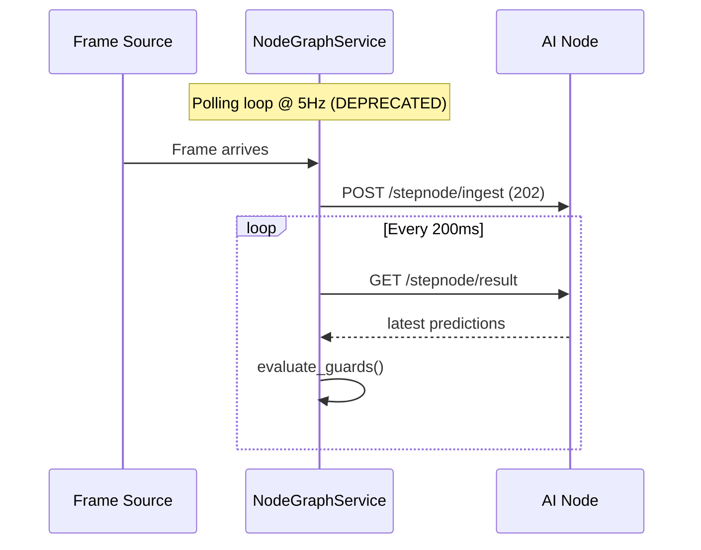

# Node Graph Procedure Strategy

This document describes the Node Graph Procedure Strategy, a state machine-based approach for procedural workflows with visual state verification.

## Overview

Node Graph Procedures differ from linear step-by-step procedures by:
- **Node-based structure** with explicit transitions rather than a linear list
- **AI prediction vectors** that return confidence scores for multiple classes
- **Guard evaluation logic** with error handling priority, stability frames, and action duration modes
- **Two verification modes**: VISUAL_STATE (static detection) and ACTION_DURATION (timed actions)

## Architecture



## Procedure Definition Format

Knowledge graphs are stored in the Memory Service and fetched via:

```
GET /knowledge-graph/{procedure_id}
```

### Response Schema

```json
{
  "id": "resource-uuid",
  "procedure_id": "proc_refill_dishwasher_salt",
  "title": "Refill Dishwasher Salt",
  "definition": {
    "procedure_id": "proc_refill_dishwasher_salt",
    "title": "Refill Dishwasher Salt",
    "version": "1.0",
    "initial_node_id": "step_01_open_door",
    "nodes": { /* see Node Structure below */ }
  }
}
```

### Node Structure

| Field | Type | Description |
|-------|------|-------------|
| `type` | string | `ACTION`, `RECOVERY`, or `FINAL` |
| `ui.title` | string | Human-readable step title |
| `ui.instruction` | string | What the user should do |
| `cortex_config` | object | AI verification configuration |
| `transitions` | object | Next node mappings |
| `error_handling` | array | (Optional) Error triggers |

### Cortex Config

| Field | Type | Description |
|-------|------|-------------|
| `target_class` | string | Class for AI to detect (e.g., "door_fully_open") |
| `verification_mode` | string | `VISUAL_STATE` or `ACTION_DURATION` |
| `min_confidence` | float | Minimum confidence threshold (0.0-1.0) |
| `stability_frames` | int | Consecutive frames to confirm (VISUAL_STATE only) |
| `duration_threshold_seconds` | float | Action duration required (ACTION_DURATION only) |
| `excluded_candidates` | array | Classes to exclude from AI scoring (optional) |
| `candidate_scope` | array | Limit AI detection to only these classes (optional) |

---

## AI Service Contract

The AI node provides two modes of operation:

### Synchronous Mode (Legacy)

Used by the **Prompt Builder** for interactive testing.

```
POST /stepnodedetection
Content-Type: multipart/form-data
```

**Form Fields:**

| Field | Type | Description |
|-------|------|-------------|
| `file` | binary | JPEG image frame |
| `user_id` | string | User identifier |
| `frame_id` | string | Unique frame identifier |
| `procedure_id` | string | Active procedure ID |
| `target_classes` | JSON array | Classes to check for (e.g., `["door_fully_open", "error_door_blocked"]`) |
| `excluded_candidates` | JSON array | Classes to exclude from scoring (optional) |
| `candidate_scope` | JSON array | Limit AI detection to only these classes (optional) |

**Response:**

```json
{
  "predictions": {
    "door_fully_open": 0.92,
    "error_door_blocked": 0.01,
    "rack_removed": 0.15
  }
}
```

---

### Asynchronous Mode (Knowledge Graph Procedure)

Used by the **NodeGraph Procedure Service** for high-throughput operation.

#### POST /stepnode/ingest

Non-blocking frame submission. Returns 202 immediately.

```
POST /stepnode/ingest
Content-Type: multipart/form-data
```

**Form Fields:**

| Field | Type | Description |
|-------|------|-------------|
| `file` | binary | JPEG image frame |
| `procedure_id` | string | Active procedure ID |
| `user_id` | string | User identifier |

**Response:** `202 Accepted` (no body)

#### GET /stepnode/result

Poll for the latest detection result.

```
GET /stepnode/result
```

**Response (200 OK):**

```json
{
  "sequence_id": 6,
  "timestamp": 1735049000.123,
  "model_version": "vqa_wrapper_v1",
  "predictions": {"door_fully_open": 0.85, "rack_removed": 0.12},
  "timings": {...},
  "_buffer_metadata": {
    "procedure_id": "proc_dishwasher",
    "inference_ms": 147,
    "processed_at": "2024-12-24T15:40:00Z"
  }
}
```

**HTTP Status Codes:**

| Code | Meaning |
|------|---------|
| 200 | Success, result returned |
| 404 | No results available yet (first call before any inference) |
| 408 | Timeout waiting for a new result |

#### GET /stepnode/stats

Get buffer statistics for monitoring.

```
GET /stepnode/stats
```

**Response:**

```json
{
  "frames_written": 1234,
  "frames_overwritten": 56,
  "frames_processed": 1178,
  "buffer_size": 1
}
```

---

### Async Architecture (Callback Mode)

The NodeGraph service now uses **callback-based result delivery** instead of polling. The AI Node pushes reasoning results to the Copilot when ready.



#### POST /api/vlm/vla_callback

Receives raw predictions from the AI Node stepnode batching pipeline. Called once per frame in chronological order.

```
POST /api/vlm/vla_callback
Content-Type: application/json
```

**Request Payload:**

```json
{
  "predictions": {
    "open_door_dishwasher": 0.85,
    "closed_door_dishwasher": 0.15
  },
  "all_probabilities": {
    "open_door_dishwasher": 0.85,
    "closed_door_dishwasher": 0.15,
    "class_irrelevant": 0.00
  },
  "sequence_id": 142,
  "timings": {
    "forward_pass_ms": 18.2,
    "total_ms": 25.3
  },
  "_buffer_metadata": {
    "procedure_id": "dishwasher_salt_v1",
    "user_id": "chef_mike",
    "session_id": "abc-123-def",
    "batch_index": 0,
    "batch_size": 8,
    "inference_ms": 202.4,
    "per_image_ms": 25.3,
    "processed_at": "2026-01-05T10:23:45.123Z"
  }
}
```

**Fields:**

| Field | Type | Description |
|-------|------|-------------|
| `predictions` | Dict | Class probabilities for target classes |
| `all_probabilities` | Dict | Full softmax distribution |
| `sequence_id` | int | Monotonic ID for deduplication |
| `_buffer_metadata.user_id` | string | **(Required)** Username from original `/ingest` |
| `_buffer_metadata.session_id` | string | Session ID for stale callback detection |
| `_buffer_metadata.batch_index` | int | Position in batch (0-based) |
| `_buffer_metadata.batch_size` | int | Total frames in this batch |

**Response:**

```json
{
  "status": "acknowledged",
  "processed": true,
  "sequence_id": 142,
  "batch_index": 0,
  "events_count": 0,
  "node_id": "step_02_remove_rack"
}
```

**Stale Callback Handling:**

If a callback arrives for a `session_id` that doesn't match the current session, the callback is gracefully discarded:

```json
{
  "status": "acknowledged",
  "processed": false,
  "reason": "stale_session"
}
```

---

### Async Architecture (Polling Mode - DEPRECATED)

> [!WARNING]
> Polling mode is deprecated. The AI Node should use the callback API instead.

The polling approach is still available in the codebase but disabled by default. To re-enable, uncomment the polling loop in `NodeGraphProcedureService.start_procedure()`.



---

## Execution Logic (State Machine)

### Step A: Context Lookup

1. Get `current_node_id` from session state
2. Look up node definition in cached knowledge graph
3. Extract `cortex_config` for this node:
   - `target_class` - what to detect
   - `verification_mode` - how to verify
   - `min_confidence` - threshold

### Step B: AI Interrogation

1. Collect all relevant classes for the current node:
   - `target_class` from `cortex_config`
   - `trigger_class` from each `error_handling` entry
2. Send frame + context to AI service
3. Receive prediction vector

### Step C: Guard Evaluation (Critical Logic)

**Priority 1: Check Errors (Safety First)**

```python
for error in node.error_handling:
    if predictions[error.trigger_class] > threshold:
        # Immediate transition to fallback
        transition_to(error.fallback_node)
        send_alert(error.message)
        return
```

**Priority 2: Check Success**

**VISUAL_STATE Mode:**
```python
score = predictions[target_class]
if score >= min_confidence:
    validation_buffer.append(True)
else:
    validation_buffer.clear()  # Strict reset

if validation_buffer.count(True) >= stability_frames:
    trigger_transition(on_success)
```

**ACTION_DURATION Mode:**
```python
score = predictions[target_class]
if score >= min_confidence:
    if action_timer_start is None:
        action_timer_start = now()
    elif (now() - action_timer_start) >= duration_threshold:
        trigger_transition(on_success)
else:
    action_timer_start = None  # Reset timer
```

### Step D: Transition Execution

When a transition is triggered:

1. Update `current_node_id` to the target node
2. Clear `validation_buffer`
3. Reset `action_timer_start` to None
4. Return new node's UI data to frontend immediately

---

## Configuration

Enable the node graph strategy in your `.env`:

```env
PROCEDURE_STRATEGY=nodegraph
AI_NODE_URL=http://localhost:8080
MEMORY_SERVICE_URL=http://localhost:8040
```

---

## API Endpoints

| Endpoint | Method | Description |
|----------|--------|-------------|
| `/api/v2/procedures/nodegraph/start` | POST | Start a node graph procedure |
| `/api/v2/procedures/nodegraph/stop` | POST | Stop the active procedure |
| `/api/v2/procedures/nodegraph/status/{username}` | GET | Get current node status |
| `/api/v2/procedures/nodegraph/debug` | GET | Debug all active sessions |

### Control API (Manual Testing)

These endpoints allow manual control over procedure progression, useful for testing:

| Endpoint | Method | Description |
|----------|--------|-------------|
| `/api/v2/procedures/nodegraph/control/auto_progress` | POST | Toggle AI-driven auto progression |
| `/api/v2/procedures/nodegraph/control/next` | POST | Force advance to next node |
| `/api/v2/procedures/nodegraph/control/prev` | POST | Return to previous node |
| `/api/v2/procedures/nodegraph/control/status` | GET | Get control state |

**Example Usage:**

```bash
# Disable auto-progression
curl -X POST http://localhost:8000/api/v2/procedures/nodegraph/control/auto_progress \
  -H "Content-Type: application/json" \
  -d '{"username": "test_user", "enabled": false}'

# Force next step
curl -X POST http://localhost:8000/api/v2/procedures/nodegraph/control/next \
  -H "Content-Type: application/json" \
  -d '{"username": "test_user"}'
```

> [!IMPORTANT]
> **Extensibility Note:** When implementing new procedure strategies, add control 
> support by implementing these methods in your service:
> - `set_auto_progress(username, enabled)` - Toggle AI-driven progression
> - `force_next_node(username)` - Advance to next step
> - `force_prev_node(username)` - Return to previous step  
> - `get_control_status(username)` - Get control state
>
> See `app/services/nodegraph_service.py` for reference implementation.

## Session State

The Node Graph Session tracks:

| Field | Type | Description |
|-------|------|-------------|
| `current_node_id` | string | Cursor position in the graph |
| `validation_buffer` | List[bool] | Recent detection results |
| `action_timer_start` | float | Timer start for ACTION_DURATION |
| `external_session_id` | string | Memory service session ID |

---

## Example Procedure

```json
{
  "procedure_id": "proc_refill_dishwasher_salt",
  "title": "Refill Dishwasher Salt",
  "version": "1.0",
  "initial_node_id": "step_01_open_door",
  "nodes": {
    "step_01_open_door": {
      "type": "ACTION",
      "ui": {
        "title": "Open Dishwasher",
        "instruction": "Pull the dishwasher door completely open."
      },
      "cortex_config": {
        "target_class": "door_fully_open",
        "verification_mode": "VISUAL_STATE",
        "min_confidence": 0.85,
        "stability_frames": 5
      },
      "transitions": {
        "on_success": "step_02_remove_rack",
        "on_timeout": "fallback_assist_door"
      }
    },
    "step_05_pour_salt": {
      "type": "ACTION",
      "ui": {
        "title": "Pour Salt",
        "instruction": "Pour dishwasher salt into the funnel until full."
      },
      "cortex_config": {
        "target_class": "pouring_salt_action",
        "verification_mode": "ACTION_DURATION",
        "duration_threshold_seconds": 5.0,
        "min_confidence": 0.75
      },
      "error_handling": [
        {
          "trigger_class": "error_spill_salt",
          "fallback_node": "fallback_wipe_spill",
          "message": "Salt spill detected! Please clean up."
        }
      ],
      "transitions": {
        "on_success": "step_06_remove_funnel"
      }
    },
    "end_procedure_complete": {
      "type": "FINAL",
      "ui": {
        "title": "Procedure Complete",
        "instruction": "Dishwasher is ready."
      }
    }
  }
}
```

---

## Related Files

| File | Purpose |
|------|---------|
| `app/domain/nodegraph_models.py` | Domain models |
| `app/domain/nodegraph_engine.py` | State machine logic |
| `app/services/nodegraph_strategy.py` | Procedure strategy |
| `app/core/nodegraph_client.py` | AI service client |
| `app/config.py` | Configuration |
